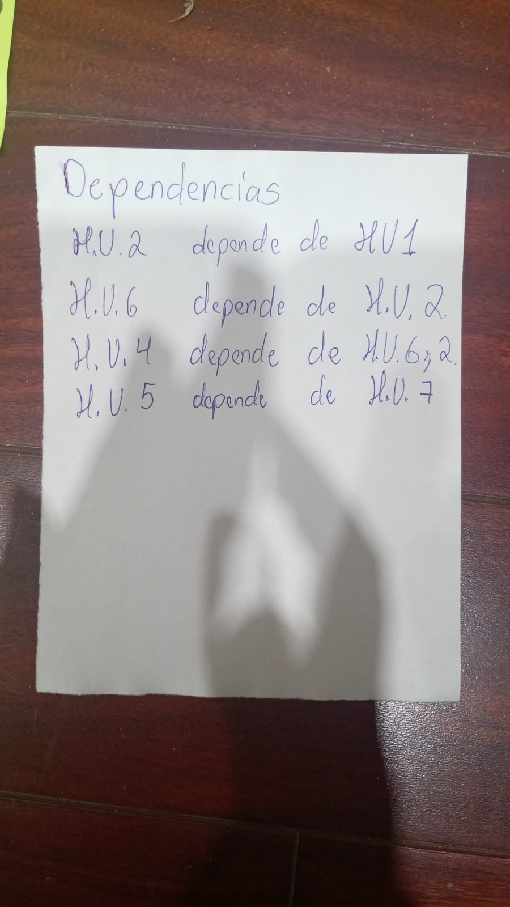
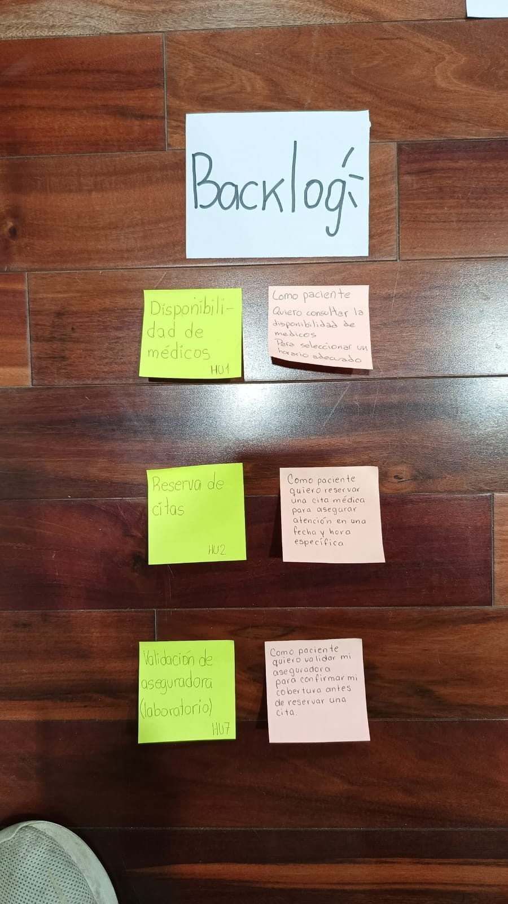

# Estimación, Dependencias y Selección (Sprint Backlog)

## 1. Estimación de Historias (Fibonacci)
Estimación base para las historias numeradas:

1. **H.U. 1 - Disponibilidad de Médicos:** 5 SP
2. **H.U. 2 - Reserva de Citas:** 8 SP
3. **H.U. 3 - Historial Médico:** 8 SP
4. **H.U. 4 - Notificaciones:** 3 SP
5. **H.U. 5 - Resultados de Laboratorio:** 8 SP
6. **H.U. 6 - Pagos Online:** 13 SP
7. **H.U. 7 - Validación Aseguradora:** 5 SP

**Suma Total del Story Mapping:** 50 SP (Excede la capacidad de 34 SP).

---

## 2. Identificación de Dependencias

* **H.U. 2** depende de **H.U. 1** (Reserva depende de Disponibilidad).
* **H.U. 6** depende de **H.U. 2** (Pagos depende de Reserva).
* **H.U. 4** depende de **H.U. 6 y H.U. 2** (Notificaciones depende de Pagos y Reserva).
* **H.U. 5** depende de **H.U. 7** (Resultados Lab. depende de Validación Aseguradora).

---

## 3. Selección de Historias (Sprint Backlog Final)
Para cumplir el **Sprint Goal**, el equipo ha decidido ir a lo seguro y enfocarse exclusivamente en el flujo principal (MVP), seleccionando **únicamente 3 historias**.

A continuación, el detalle de las historias comprometidas, redactadas exactamente como en sus post-its:

### H.U. 1 - Disponibilidad de médicos (5 SP)
> **Como** paciente,
> **Quiero** consultar la disponibilidad de médicos,
> **Para** seleccionar un horario adecuado.

### H.U. 2 - Reserva de citas (8 SP)
> **Como** paciente,
> **Quiero** reservar una cita médica,
> **Para** asegurar atención en una fecha y hora específica.

### H.U. 7 - Validación de aseguradora (laboratorio) (5 SP)
> **Como** paciente,
> **Quiero** validar mi aseguradora,
> **Para** confirmar mi cobertura antes de reservar una cita.

---
**Total Comprometido en el Sprint:** 18 SP 

*(Nota del cálculo: El equipo cuenta con una Capacidad Inicial de 34 SP, por lo que este Sprint Backlog de 18 SP es perfectamente asumible y de bajo riesgo, asegurando el éxito total del MVP en el tiempo estimado).*
