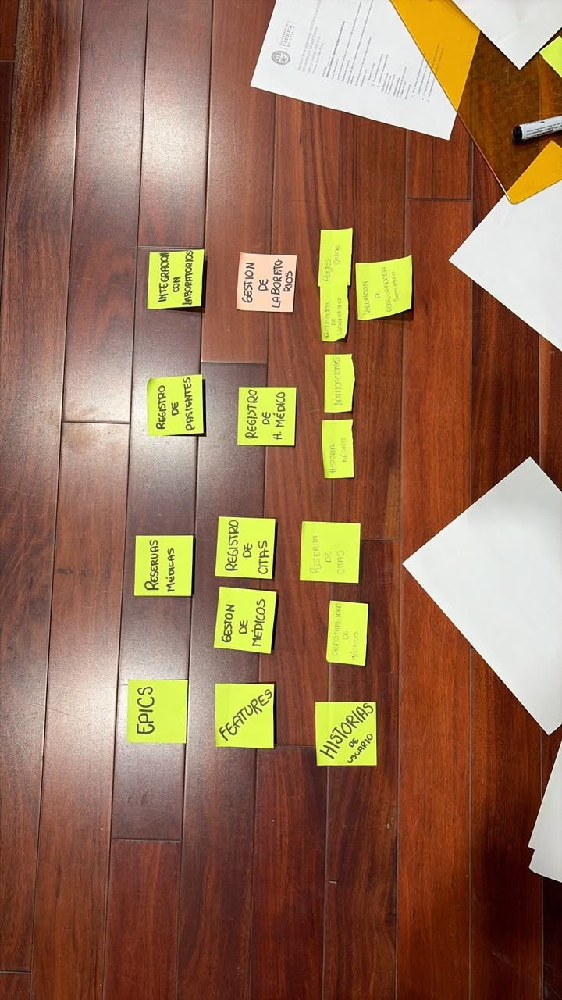

# Story Mapping - Clínica / Centro Médico

A continuación se detalla la estructura transcrita a partir de los post-its de la fotografía:

## EPIC 1: Reservas Médicas
* **Feature:** Gestión de Médicos
  * **Historia de Usuario 1:** Disponibilidad de Médicos
* **Feature:** Registro de Citas
  * **Historia de Usuario 2:** Reserva de Citas

## EPIC 2: Registro de Pacientes
* **Feature:** Registro de H. Médico
  * **Historia de Usuario 3:** Historial Médico
  * **Historia de Usuario 4:** Notificaciones

## EPIC 3: Integración con Laboratorios
* **Feature:** Gestión de Laboratorios
  * **Historia de Usuario 5:** Resultados de Laboratorio
  * **Historia de Usuario 6:** Pagos Online
  * **Historia de Usuario 7:** Validación Aseguradora

---
**Total de Historias identificadas:** 7 historias.
