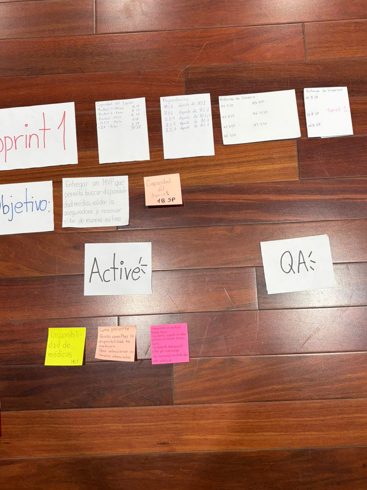
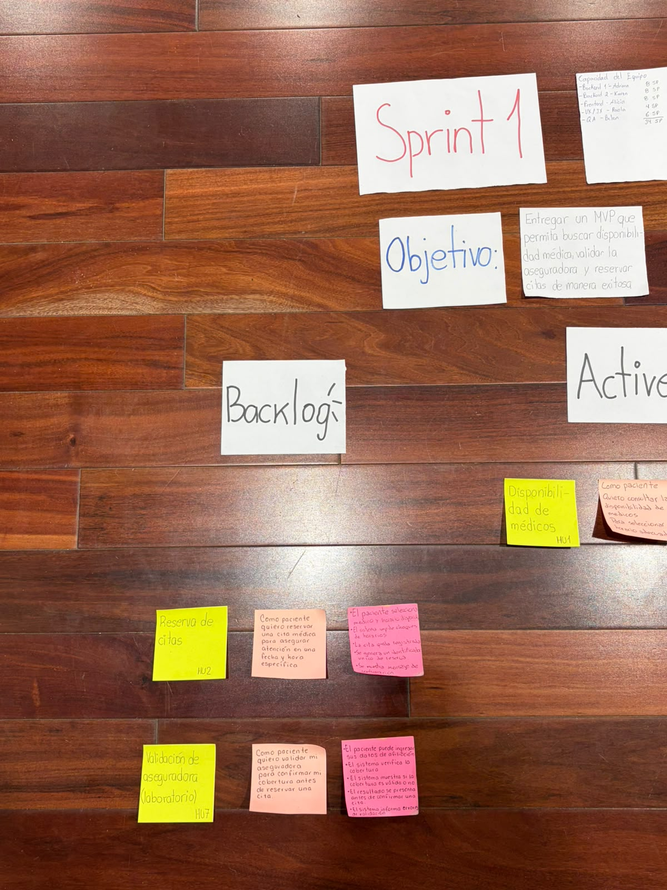

# Fase 4 - Sprint Review

## 1. Incremento del Producto y Criterios de Aceptación
Durante el Sprint Review, el equipo demostró las 3 Historias de Usuario desarrolladas (HU1, HU2 y HU7), las cuales cumplieron con la Definición de Terminado (DoD) y superaron los siguientes **Criterios de Aceptación** transcritos a partir del tablero Scrum:

### H.U. 1 - Disponibilidad de Médicos
* Únicamente se mostrarán horarios libres.
* La búsqueda debe permitir filtrar por especialidad.
* La información mostrada debe estar actualizada.

### H.U. 2 - Reserva de Citas
* El paciente selecciona médico y horario disponible.
* El sistema impide choques de horarios.
* La cita queda registrada.
* Se genera un identificador único de reserva.
* Se muestra mensaje de confirmación.

### H.U. 7 - Validación de Aseguradora (Laboratorio)
* El paciente puede ingresar sus datos de afiliación.
* El sistema verifica la cobertura.
* El sistema muestra si la cobertura es válida o no.
* El resultado se presenta antes de confirmar una cita.
* El sistema informa errores de validación.

*(Nota: Como resolvimos en la Fase 3, la conexión real a la API de laboratorio en la HU7 fue simulada para evitar bloqueos y demostrar valor rápidamente al cliente).*

## 2. Entregables de la Revisión
En la subcarpeta `Entregables` de esta fase se han consolidado:
1.  **MediLink_Sprint_Review.pptx:** Presentación oficial de resultados lista para exponer.
2.  **Fotografías del Tablero Scrum:** Evidencia visual de las historias en las columnas "Active" y "QA", demostrando el seguimiento del progreso.

---

## 3. Retrospectiva (Sprint Retrospective)
Tras finalizar el Review y entregar el incremento de producto, el equipo debe hacer su retrospectiva. Aquí hay una propuesta de puntos a discutir basados en lo ocurrido en el examen:

*   **¿Qué salió bien?** La planificación inicial conservadora (tomar 18 SP teniendo 34 SP de capacidad) fue crucial. Eso nos permitió flexibilidad ante las restricciones sorpresa.
*   **¿Qué aprendimos?** El agilismo real significa adaptarse. Mockear la API inestable fue un claro ejemplo de entregar valor de negocio sin depender rígidamente de un obstáculo técnico.
*   **¿Qué podemos mejorar?** Para futuros Sprints, identificar proveedores externos críticos (como APIs) desde el inicio y preparar un "Plan B" desde la etapa de modelado.
